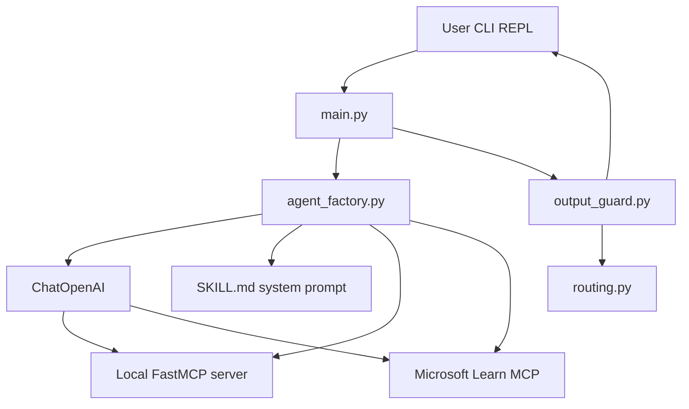

# Project Overview

**Local File Search MCP Agent** — a LangChain CLI agent that combines an in-process FastMCP local file search server with the remote Microsoft Learn MCP (`streamable_http`). The LLM routes queries via `SKILL.md`, returns JSON-only answers for local file queries, prose (?2000 chars) for Microsoft/Azure questions, and a fixed out-of-scope JSON error for everything else.

---

## Executive summary

| Aspect | Detail |
|--------|--------|
| Interface | Async REPL CLI (`file-search-agent`) |
| Local tools | In-process FastMCP: `search_files`, `search_pdf_content`, `list_all_files`, `read_pdf_content` |
| Remote tools | Microsoft Learn MCP at `https://learn.microsoft.com/api/mcp` |
| LLM | `ChatOpenAI` with OpenAI-compatible API (default **MiniMax-M2.7**) |
| Sandbox | All local paths constrained to `SEARCH_ROOT` |
| Verification | 34 pytest, ruff, E2E 5/5, spot-check 3/3 |

---

## Architecture

**Request flow:**

1. User types a query in the REPL (`main.py`).
2. LangChain agent (`create_agent` in `agent_factory.py`) invokes `ChatOpenAI` with local + Learn tools.
3. The model selects tools per `SKILL.md` routing rules.
4. `output_guard.py` post-processes the response: JSON extraction for local queries, truncation for MS answers, artifact stripping for reasoning models.
5. Guarded text is printed to the user.

---

## Component map

| File | Responsibility |
|------|----------------|
| `src/file_search_agent/main.py` | Async REPL; invokes agent, applies output guard |
| `src/file_search_agent/agent_factory.py` | Builds `ChatOpenAI`, loads MCP tools, `create_agent` |
| `src/file_search_agent/config.py` | Env vars: API keys, `SEARCH_ROOT`, Learn URL, limits |
| `src/file_search_agent/mcp/local_file_search.py` | FastMCP server: search, list, read PDF tools |
| `src/file_search_agent/models.py` | Pydantic models; dual JSON keys (internal + assignment aliases) |
| `src/file_search_agent/routing.py` | Tool name sets, out-of-scope error constant |
| `src/file_search_agent/output_guard.py` | JSON enforcement, MS truncation, tool-JSON preference |
| `SKILL.md` | System prompt: routing rules and response contracts |
| `scripts/generate_samples.py` | Regenerates 8 zoology sample files |
| `scripts/e2e_verify.py` | Non-interactive 5-check E2E gate |
| `scripts/spotcheck_assignment.py` | 3-query assignment spot-check |

---

## Assignment compliance

Full audit: [COMPLIANCE_REPORT.md](COMPLIANCE_REPORT.md) (commit `4c26bd0`).

| Gate | Result |
|------|--------|
| pytest | **34 passed** |
| ruff | **PASS** |
| E2E (`e2e_verify.py`) | **5/5 PASS** |
| Spot-check (`spotcheck_assignment.py`) | **3/3 PASS** |
| Sample files | **8** in `data/samples/zoology/` |
| `.env` in git | **Not tracked** |

### Intentional deviations vs assignment paste

| Assignment paste | This repo |
|------------------|-----------|
| `mcp-file-agent/` tree | Flat `src/file_search_agent/` (same behavior) |
| `AgentExecutor` + GPT-4o/5.x | `create_agent` + **MiniMax-M2.7** default; swap via env |
| MS Learn SSE wrapper | **streamable_http** native Learn tools |
| `data/sample_files/` | `data/samples/zoology/` + `FILE_SEARCH_ROOT` alias |
| JSON keys `files`, `file_name`, `total_found` | Dual keys in `models.py` (internal + assignment aliases) |

---

## Sample data

Eight non-technical zoology files under `data/samples/zoology/`:

| File | Extension |
|------|-----------|
| `african_elephant_study.pdf` | .pdf |
| `marine_mammals_report.pdf` | .pdf |
| `bird_migration_analysis.pdf` | .pdf |
| `amphibian_survey_2023.pdf` | .pdf |
| `coral_reef_observations.docx` | .docx |
| `species_count_2024.xlsx` | .xlsx |
| `field_notes_borneo.txt` | .txt |
| `jaguar_photo_rainforest.jpg` | .jpg |

Regenerate: `python scripts/generate_samples.py`

Sandbox rules (`config.py`):

- `SEARCH_ROOT` defaults to `data/samples/zoology` (relative paths resolved from project root).
- Path traversal outside the sandbox is rejected (`test_security.py`).

---

## Verification toolchain

| Tool | Command | API key required |
|------|---------|------------------|
| Lint | `ruff check src tests scripts` | No |
| Unit tests | `pytest -v` | No |
| E2E | `python -u scripts/e2e_verify.py` | Yes |
| Spot-check | `python -u scripts/spotcheck_assignment.py` | Yes |
| Interactive smoke | `file-search-agent` | Yes |

---

## Git history snapshot

| Commit | Summary |
|--------|---------|
| `6b2d449` | Initial Local File Search MCP Agent implementation |
| `2d0f711` | Align with assignment spec; MiniMax M2.7 E2E verification |
| `09dcbbe` | Production QA: E2E verification, routing, docs |
| `4c26bd0` | Compliance audit: output guards, JSON aliases, spot-check script |

These commits are documented as a snapshot; they are not auto-updated on every change.

---

## Next steps

- Switch LLM provider: [LLM_PROVIDER_GUIDE.md](LLM_PROVIDER_GUIDE.md)
- Deploy: [DEPLOYMENT.md](DEPLOYMENT.md)
- Operate: [OPERATIONS.md](OPERATIONS.md)
